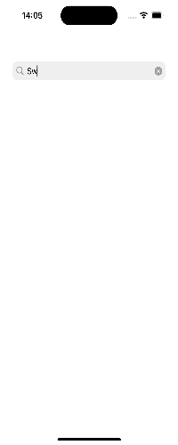

# 株式会社ゆめみ様 iOS エンジニアコードチェック課題
created 金子

## 始めに
今回はコーディング試験の機会を設けていただき誠にありがとうございます。

## 概要

本プロジェクトは株式会社ゆめみ（以下弊社）が、弊社に iOS エンジニアを希望する方に出す課題のベースプロジェクトです。本課題が与えられた方は、下記の説明を詳しく読んだ上で課題を取り組んでください。

新卒／未経験者エンジニアの場合、本リファクタリングの通常課題の代わりに、[新規アプリ作成の特別課題](https://yumemi-ios-junior-engineer-codecheck.app.swift.cloud)も選択できますので、ご自身が得意と感じる方を選んでください。特別課題を選んだ場合、通常課題の取り組みは不要です。新規アプリ作成の課題の説明を詳しく読んだ上で課題を取り組んでください。

## アプリ仕様
本アプリは GitHub のリポジトリーを検索するアプリです。  

### 動作イメージ

### 環境

- IDE：Xcode 15.2
- 開発ターゲット：iOS17.5
- シュミレーター: iPone15 Pro 

### アーキテクチャ
Vipper

### 工夫したポイント
- GUI上でのUI管理をやめてUIKitのコードのみで実装し直しました
- コードの可読性を上げるため extensionの切り方を気をつけて実装しました。
